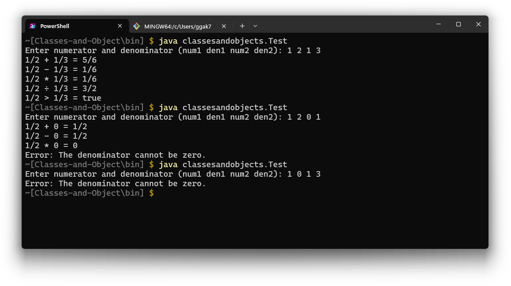

# Lab 2: Classes and Objects
**Student ID**:  202336020211   
**Name**:  AL RAIMI ABDULLAH   
**Grade**:  

## Introduction
A fraction (from Latin *fractus*, "broken") represents a part of a whole or, more generally, any number of equal parts. When spoken in everyday English, a fraction describes how many parts of a certain size there are, for example, one-half, eight-fifths, three-quarters.

A common, vulgar, or simple fraction (examples: 1/2 and 17/3) consists of a numerator displayed above a line (or before a slash like 1⁄2), and a non-zero denominator, displayed below (or after) that line. Numerators and denominators are also used in fractions that are not common, including compound fractions, complex fractions, and mixed numerals.

In positive common fractions, the numerator and denominator are natural numbers. The numerator represents a number of equal parts, and the denominator indicates how many of those parts make up a unit or a whole. The denominator cannot be zero, because zero parts can never make up a whole. For example, in the fraction 3/4, the numerator 3 indicates that the fraction represents 3 equal parts, and the denominator 4 indicates that 4 parts make up a whole.

<br>

The picture below illustrates 3/4 of a cake:
<div style="text-align: center;">
  
</div>

<details>
<summary>Fig. 1</summary>

A cake with one quarter (one fourth) removed. The remaining three fourths are shown by dotted lines and labeled by the fraction 1/4.

</details>


A common fraction is a numeral that represents a rational number. That same number can also be represented as a decimal, a percent, or with a negative exponent. For example, 0.01, 1%, and 10⁻² are all equal to the fraction 1/100. An integer can be thought of as having an implicit denominator of one (for example, 7 equals 7/1).

<br>

## Arithmetic with Fractions
```
1/2 + 1/3 = (3/2 * 3) + (2/3 * 2) = 3/6 + 2/6 = 5/6
```

### Subtraction
```
1/2 - 1/3 = (3/2 * 3) - (2/3 * 2) = 3/6 - 2/6 = 1/6
```

### Multiplication
```
1/2 * 1/3 = 1/2 * 1/3 = 1/6
```

### Division
```
1/2 ÷ 1/3 = 1/2 * 3/1 = 3/2
```

### Comparison
```
1/2 > 1/3
```

<br>

## Tasks
1. **Design a class named `Fraction`** that describes a fraction. Assume the numerator and denominator are natural numbers.
   - Design attributes to represent a fraction clearly.
   - Design behaviors to perform addition, subtraction, multiplication, division, and comparison.
   - Overload constructors to create objects easily.

2. **Create an application** to check if the Java class `Fraction` is functional.

### Sample Output
The sample output format is for reference only. Feel free to change the output format as long as it is clearly understandable.

#### Example 1:
**Input**:  
```
1 2 1 3
```
**Output**:  
```
1/2 + 1/3 = 5/6  
1/2 - 1/3 = 1/6  
1/2 * 1/3 = 1/6  
1/2 ÷ 1/3 = 3/2
```

#### Example 2:
**Input**:  
```
1 2 0 1
```
**Output**:  
```
1/2 + 0 = 1/2  
1/2 - 0 = 1/2  
1/2 * 0 = 0  
Exception: Division by zero
```

#### Example 3:
**Input**:  
```
1 0 1 3
```
**Output**:  
```
The denominator cannot be zero.
```

<br>

### Code:

#### Class `Fraction`

```java
package classesandobjects;

public class Fraction {
    private int numerator;
    private int denominator;

    public Fraction() {
        this.numerator = 0;
        this.denominator = 1;
    }

    public Fraction(int numerator, int denominator) {
        if (denominator == 0) {
            throw new IllegalArgumentException("The denominator cannot be zero.");
        }
        this.numerator = numerator;
        this.denominator = denominator;
        simplify();
    }

    public Fraction add(Fraction other) {
        int num = this.numerator * other.denominator + other.numerator * this.denominator;
        int den = this.denominator * other.denominator;
        return new Fraction(num, den);
    }

    public Fraction subtract(Fraction other) {
        int num = this.numerator * other.denominator - other.numerator * this.denominator;
        int den = this.denominator * other.denominator;
        return new Fraction(num, den);
    }

    public Fraction multiply(Fraction other) {
        int num = this.numerator * other.numerator;
        int den = this.denominator * other.denominator;
        return new Fraction(num, den);
    }

    public Fraction divide(Fraction other) {
        if (other.numerator == 0) {
            throw new ArithmeticException("Division by zero.");
        }
        int num = this.numerator * other.denominator;
        int den = this.denominator * other.numerator;
        return new Fraction(num, den);
    }

    private void simplify() {
        int gcd = gcd(numerator, denominator);
        numerator /= gcd;
        denominator /= gcd;
    }

    private int gcd(int a, int b) {
        if (b == 0) return a;
        return gcd(b, a % b);
    }

    @Override
    public String toString() {
        if (denominator == 1) return String.valueOf(numerator);
        return numerator + "/" + denominator;
    }

    public boolean isGreaterThan(Fraction other) {
        return this.numerator * other.denominator > other.numerator * this.denominator;
    }
}
```

<br>

#### Class `Test`
```java
package classesandobjects;

import java.util.Scanner;

public class Test {
    public static void main(String[] args) {
        Scanner scanner = new Scanner(System.in);

        System.out.println("Enter numerator and denominator for the first fraction:");
        int num1 = scanner.nextInt();
        int den1 = scanner.nextInt();

        System.out.println("Enter numerator and denominator for the second fraction:");
        int num2 = scanner.nextInt();
        int den2 = scanner.nextInt();

        scanner.close();

        try {
            Fraction fraction1 = new Fraction(num1, den1);
            Fraction fraction2 = new Fraction(num2, den2);

            System.out.println(fraction1 + " + " + fraction2 + " = " + fraction1.add(fraction2));
            System.out.println(fraction1 + " - " + fraction2 + " = " + fraction1.subtract(fraction2));
            System.out.println(fraction1 + " * " + fraction2 + " = " + fraction1.multiply(fraction2));
            System.out.println(fraction1 + " ÷ " + fraction2 + " = " + fraction1.divide(fraction2));
            System.out.println(fraction1 + " > " + fraction2 + " = " + fraction1.isGreaterThan(fraction2));
        } catch (IllegalArgumentException e) {
            System.out.println(e.getMessage());
        } catch (ArithmeticException e) {
            System.out.println("Exception: " + e.getMessage());
        }
    }
}
```

<br>

### Output:

<div style="text-align: center;">
  
</div>

<br>

> Feel free to visit my Java repository [here](https://github.com/Al-rimi/java)