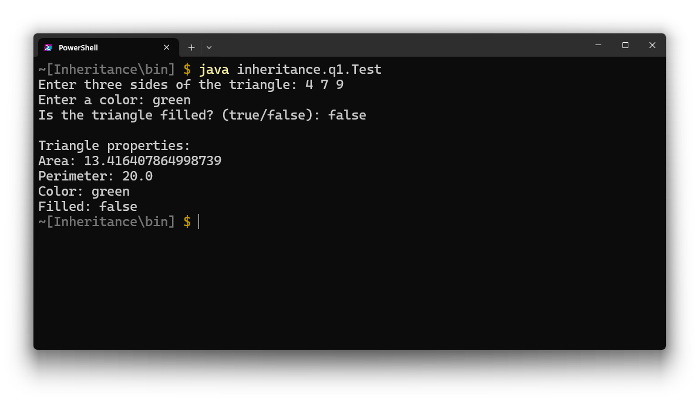
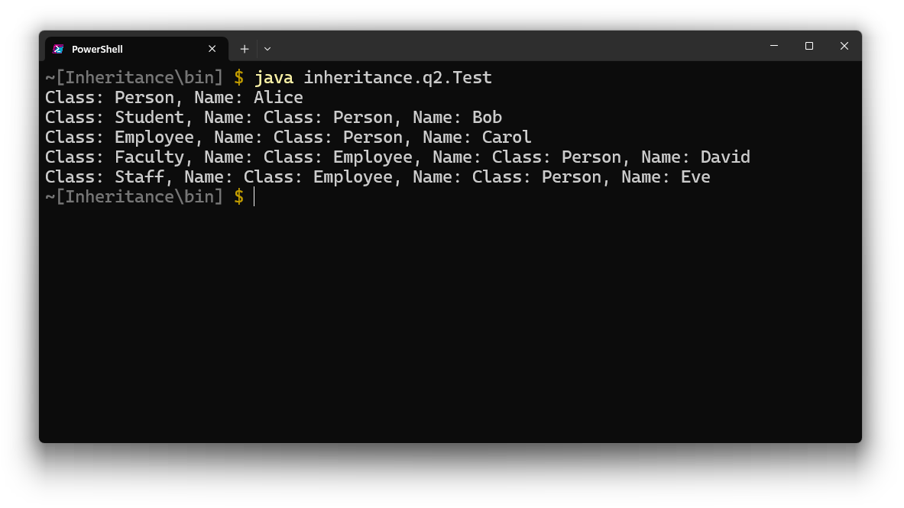

<div style="text-align: center;">

# Object-Oriented Programming: Inheritance

</div>

<br>

### Ex1. Design a class named Triangle that extends GeometricObject. The class contains:

- Three double data fields named side1, side2, and side3 with default values 1.0 to denote three sides of triangle.  
- A no-arg constructor that creates a default triangle.  
- A constructor that creates a triangle with the specified side1, side2, and side3.  
- The accessor methods for all three data fields.  
- A method named getArea() that returns the area of this triangle.  
- A method named getPerimeter() that returns the perimeter of this triangle.  
- A method named toString() that returns a string description for the triangle such as “Triangle: side1 = ”+side1+” side2 =” + side2+” side3 = ”+side3.  

The class GeometricObject contains:

- A string data field named color to denote its filled color.  
- A boolean data field named filled to denote if it is filled with the filled color.  
- A method named getArea() that returns the area of this geometry.  
- A method named getPerimeter() that returns the perimeter of this geometry.  

Write a test program that prompts the user to enter three sides of the triangle, a color, and a Boolean value to indicate whether the triangle is filled. The program should create a Triangle object with these sides and set the color and filled properties using the input. The program should display the area, perimeter, color, and true or false to indicate whether it is filled or not. 

<br>

### Code:

#### Class `GeometricObject`

```java
package inheritance.q1;

public class GeometricObject {
    private String color;
    private boolean filled;

    public GeometricObject() {
        this.color = "white";
        this.filled = false;
    }

    public GeometricObject(String color, boolean filled) {
        this.color = color;
        this.filled = filled;
    }

    public String getColor() {
        return color;
    }

    public void setColor(String color) {
        this.color = color;
    }

    public boolean isFilled() {
        return filled;
    }

    public void setFilled(boolean filled) {
        this.filled = filled;
    }

    public double getArea() {
        return 0.0; // To be overridden
    }

    public double getPerimeter() {
        return 0.0; // To be overridden
    }
}
```

<br>

#### Class `Triangle`

```java
package inheritance.q1;

public class Triangle extends GeometricObject {
    private double side1;
    private double side2;
    private double side3;

    public Triangle() {
        this.side1 = 1.0;
        this.side2 = 1.0;
        this.side3 = 1.0;
    }

    public Triangle(double side1, double side2, double side3) {
        this.side1 = side1;
        this.side2 = side2;
        this.side3 = side3;
    }

    public double getSide1() {
        return side1;
    }

    public double getSide2() {
        return side2;
    }

    public double getSide3() {
        return side3;
    }

    public double getArea() {
        double s = getPerimeter() / 2;
        return Math.sqrt(s * (s - side1) * (s - side2) * (s - side3));
    }

    public double getPerimeter() {
        return side1 + side2 + side3;
    }

    @Override
    public String toString() {
        return "Triangle: side1 = " + side1 + ", side2 = " + side2 + ", side3 = " + side3;
    }
}
```
<br>

#### Class `Test`

```java
package inheritance.q1;

import java.util.Scanner;

public class Test {
    public static void main(String[] args) {
        Scanner input = new Scanner(System.in);

        System.out.print("Enter three sides of the triangle: ");
        double side1 = input.nextDouble();
        double side2 = input.nextDouble();
        double side3 = input.nextDouble();

        System.out.print("Enter a color: ");
        String color = input.next();

        System.out.print("Is the triangle filled? (true/false): ");
        boolean filled = input.nextBoolean();

        input.close();
        
        Triangle triangle = new Triangle(side1, side2, side3);
        triangle.setColor(color);
        triangle.setFilled(filled);

        System.out.println("\nTriangle properties:");
        System.out.println("Area: " + triangle.getArea());
        System.out.println("Perimeter: " + triangle.getPerimeter());
        System.out.println("Color: " + triangle.getColor());
        System.out.println("Filled: " + triangle.isFilled());
    }
}
```
<br>

### Output:

<div style="width: 100%; text-align: center;">



</div>

---

<br>

<br>

### Ex2. Design a class named Person and its two subclasses named Student and Employee. Make Faculty and Staff subclasses of Employee.  
- A person has a name, address, phone number, and e-mail address.  
- A student has a class status (freshman, sophomore, junior, senior). Define the status as a constant.  
- An employee has an office, salary, and date hired.  
- A faculty member has office hours and a rank.  
- A staff member has a title.  
- Override the toString() method in each class to display the class name and the person’s name.  

Write a test program that creates a Person, Student, Employee, Faculty, and Staff, and invokes their toString() methods.  

<br>

### Code:

#### Class `Person`

```java
package inheritance.q2;

public class Person {
    private String name;
    private String address;
    private String phoneNumber;
    private String email;

    public Person(String name, String address, String phoneNumber, String email) {
        this.name = name;
        this.address = address;
        this.phoneNumber = phoneNumber;
        this.email = email;
    }

    @Override
    public String toString() {
        return "Class: Person, Name: " + name;
    }
}
```

<br>

#### Class `Student`

```java
package inheritance.q2;

public class Student extends Person {
    public static final String FRESHMAN = "Freshman";
    public static final String SOPHOMORE = "Sophomore";
    public static final String JUNIOR = "Junior";
    public static final String SENIOR = "Senior";

    private String status;

    public Student(String name, String address, String phoneNumber, String email, String status) {
        super(name, address, phoneNumber, email);
        this.status = status;
    }

    @Override
    public String toString() {
        return "Class: Student, Name: " + super.toString();
    }
}
```

<br>

#### Class `Employee`

```java
package inheritance.q2;

public class Employee extends Person {
    private String office;
    private double salary;
    private String dateHired;

    public Employee(String name, String address, String phoneNumber, String email, String office, double salary, String dateHired) {
        super(name, address, phoneNumber, email);
        this.office = office;
        this.salary = salary;
        this.dateHired = dateHired;
    }

    @Override
    public String toString() {
        return "Class: Employee, Name: " + super.toString();
    }
}
```

<br>

#### Class `Faculty`

```java
package inheritance.q2;

public class Faculty extends Employee {
    private String officeHours;
    private String rank;

    public Faculty(String name, String address, String phoneNumber, String email, String office, double salary, String dateHired, String officeHours, String rank) {
        super(name, address, phoneNumber, email, office, salary, dateHired);
        this.officeHours = officeHours;
        this.rank = rank;
    }

    @Override
    public String toString() {
        return "Class: Faculty, Name: " + super.toString();
    }
}
```

<br>

#### Class `Staff`

```java
package inheritance.q2;

public class Staff extends Employee {
    private String title;

    public Staff(String name, String address, String phoneNumber, String email, String office, double salary, String dateHired, String title) {
        super(name, address, phoneNumber, email, office, salary, dateHired);
        this.title = title;
    }

    @Override
    public String toString() {
        return "Class: Staff, Name: " + super.toString();
    }
}
```

<br>

#### Class `Test`

```java
package inheritance.q2;

public class Test {
    public static void main(String[] args) {
        Person person = new Person("Alice", "123 Main St", "555-1234", "alice@example.com");
        Student student = new Student("Bob", "456 College Ave", "555-5678", "bob@example.com", Student.FRESHMAN);
        Employee employee = new Employee("Carol", "789 Office Rd", "555-8765", "carol@example.com", "Office 101", 50000, "01/01/2020");
        Faculty faculty = new Faculty("David", "321 Faculty Dr", "555-4321", "david@example.com", "Office 202", 60000, "01/01/2015", "9am-5pm", "Professor");
        Staff staff = new Staff("Eve", "654 Staff Ln", "555-6789", "eve@example.com", "Office 303", 40000, "01/01/2018", "Manager");

        System.out.println(person);
        System.out.println(student);
        System.out.println(employee);
        System.out.println(faculty);
        System.out.println(staff);
    }
}
```

<br>

### Output:


<div style="text-align: center;">
  
</div>

---

<br>

<br>

### Ex3. Class Object is the root of the class hierarchy. Each class has Object as its superclass.  
The class Object has many important methods, such as equals(), toString(), getClass(), clone(), etc.  

Design a class named Circle to represent a circle and override methods:  
- **equals(Object obj)**:  
  The method returns true if and only if the radius equals to the radius of obj.  

- **toString()**:  
  The method returns a string representation of the object. Ex. “This is a Circle with the radius of XXX”. If the radius is 10, then it returns “This is a Circle with the radius of 10”.  

<br>

### Code:

#### Class `Circle`

```java
package inheritance.q3;

public class Circle {
    private double radius;

    public Circle(double radius) {
        this.radius = radius;
    }

    public double getRadius() {
        return radius;
    }

    @Override
    public boolean equals(Object obj) {
        if (obj instanceof Circle) {
            Circle other = (Circle) obj;
            return this.radius == other.radius;
        }
        return false;
    }

    @Override
    public String toString() {
        return "This is a Circle with the radius of " + radius;
    }
}
```

<br>

#### Class `Test`

```java
package inheritance.q3;

public class TestCircle {
    public static void main(String[] args) {
        Circle circle1 = new Circle(10);
        Circle circle2 = new Circle(10);
        Circle circle3 = new Circle(15);

        System.out.println(circle1);
        System.out.println(circle

2.equals(circle1)); // true
        System.out.println(circle3.equals(circle1)); // false
    }
}
```

<br>

### Output:

<div style="text-align: center;">
  
</div>

---
<br>

> Feel free to visit my java documentation [Github](https://github.com/al-rimi/java)